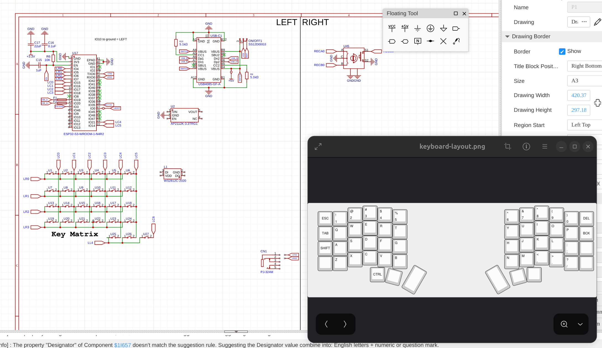
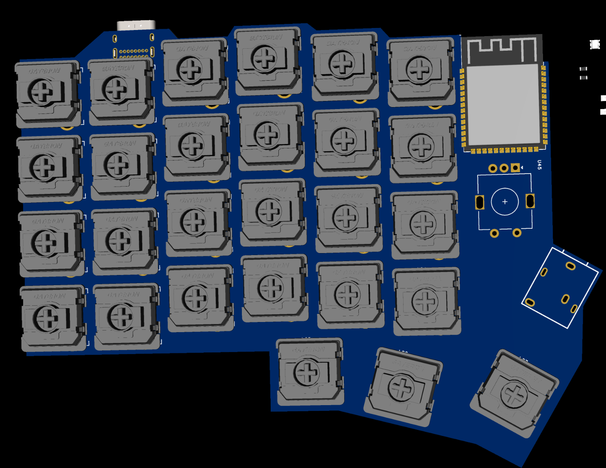
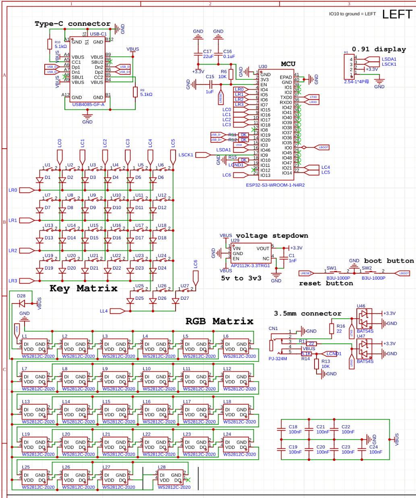
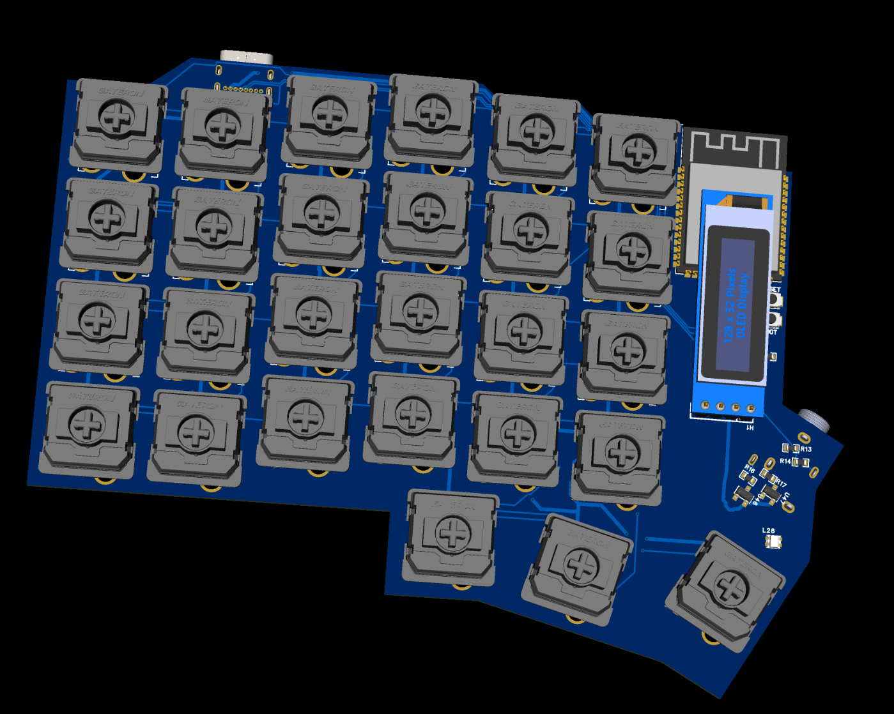
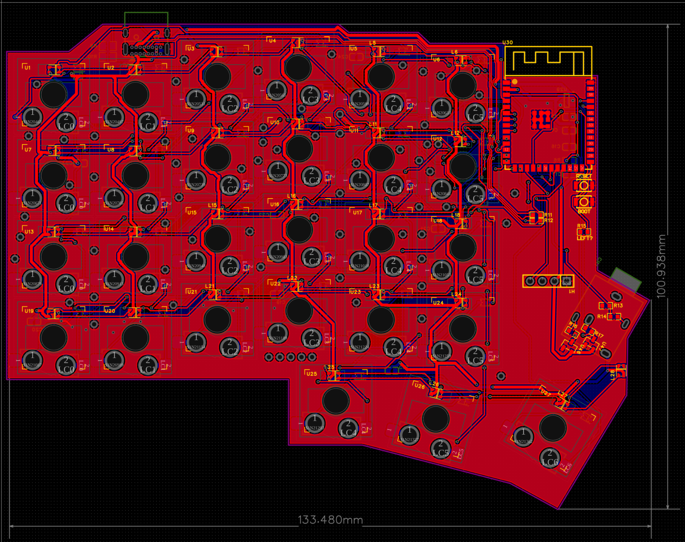
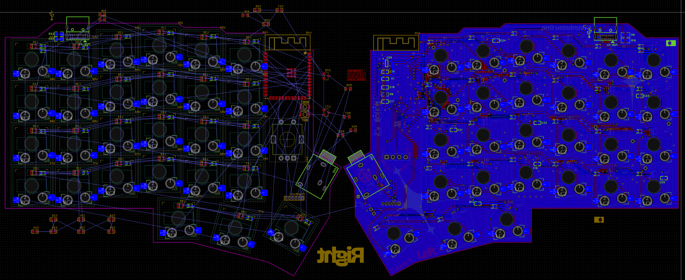
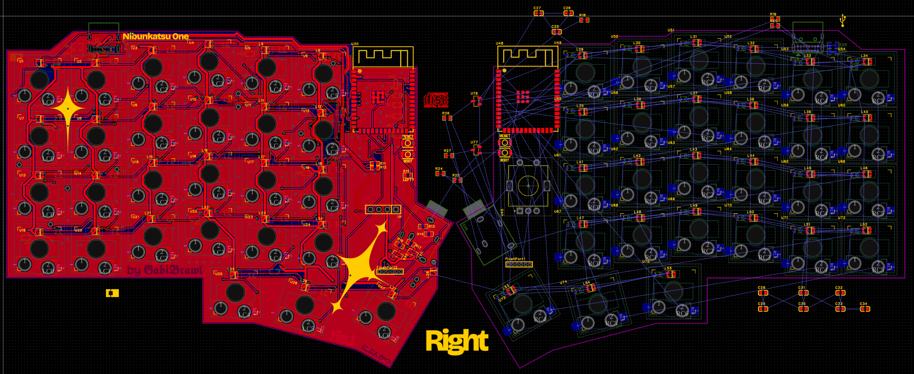
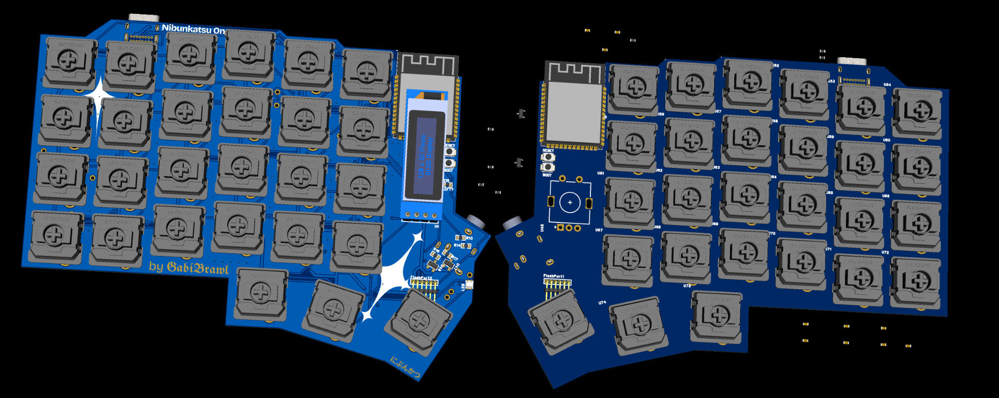
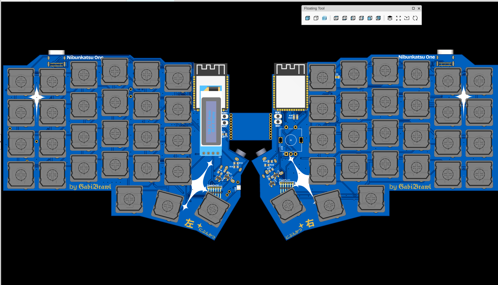
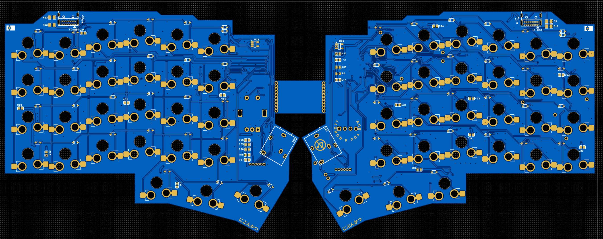

## 12/03/2025 - Planning and Design

Started with initial keyboard layout design and component selection, alongside left-side schematics started and pcb design.

## 12/04/2025 - More planning and design
Kept iterating with the pcb design and schematic, still on the left side only.

## 12/05/2025 - Even more planning and design

Began working on the right side schematic and pcb design. Added custom artwork to the pcb.

## 12/06/2025 - Final design

Finalized both sides of the schematic and pcb design. Prepared files for manufacturing.
Only on PCB planning and design I easily spent around 30 hours, in those 4 days.

