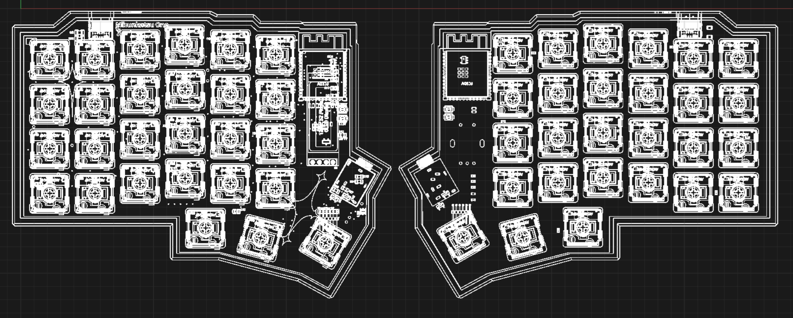
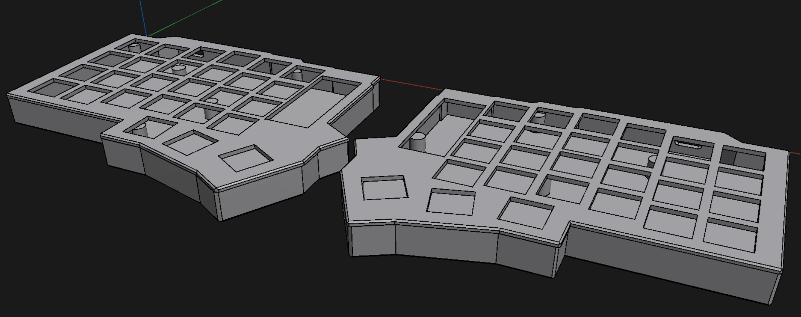
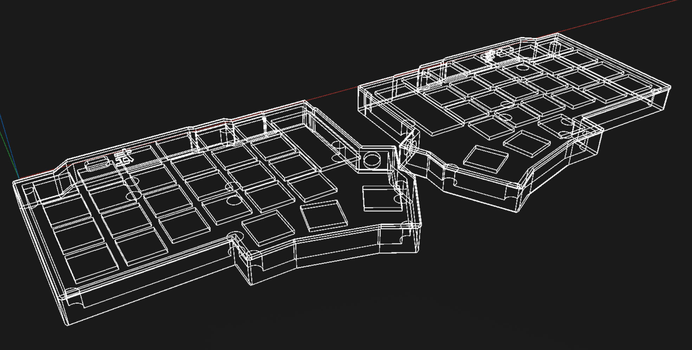

## 12/03/2025 - Planning and Design

Started with initial keyboard layout design and component selection, alongside left-side schematics started and pcb design.

## 12/04/2025 - More planning and design
Kept iterating with the pcb design and schematic, still on the left side only.

## 12/05/2025 - Even more planning and design

Began working on the right side schematic and pcb design. Added custom artwork to the pcb.

## 12/06/2025 - Final PCB design

Finalized both sides of the schematic and pcb design. Prepared files for manufacturing.
Only on PCB planning and design I easily spent around 30 hours, in those 4 days.

## 12/08/2025 - 3D CAD Modeling

Made the 3D model for both sides of Nibunkatsu using Shapr3D! This is my first time modeling something in 3D, and I'm absolutely impressed by the result!! This is so much easier than I've ever expected it to be :D

## 12/10/2025 - 0.91 inch display UI design and testing

Made a sample UI design that fits the vertical layout of the 0.91 inch display, and tested it on an actual display module. I looked up online and didn't find anyone using this display in vertical orientation, so I had to improvise a bit. But it is turning out great! This is by no means the final, but gives a taste. :P
Everything was designed using lopaka.app, which is an amazing tool for making pixel art and small UIs for displays like this.

## 12/11/2025 - 3D Model Improvements
After procastinating for a while, I finally decided to improve on the 3D models more. Added support cilinders to hold the PCBs in the right height, and made the plates where the switches will be mounted on! Now there are 4 models to be printed: Left case, Right case, Left plate and Right plate.

