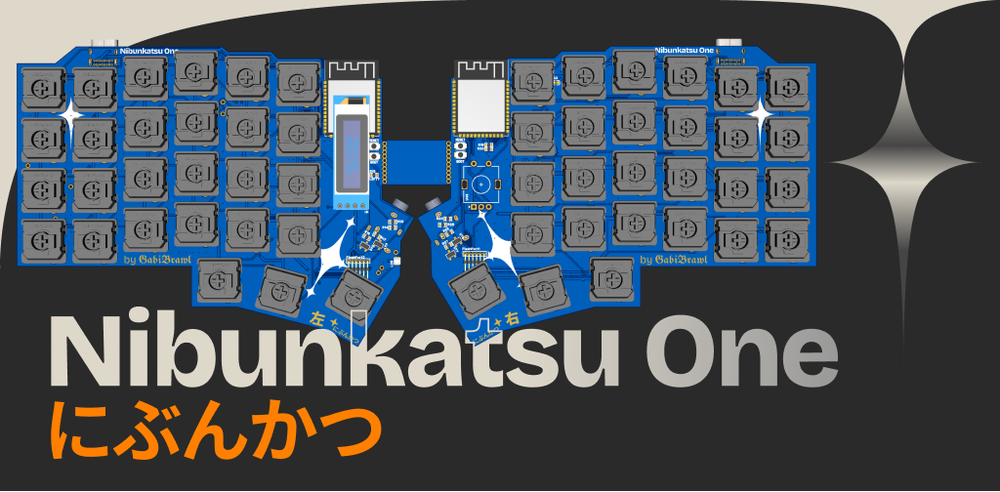
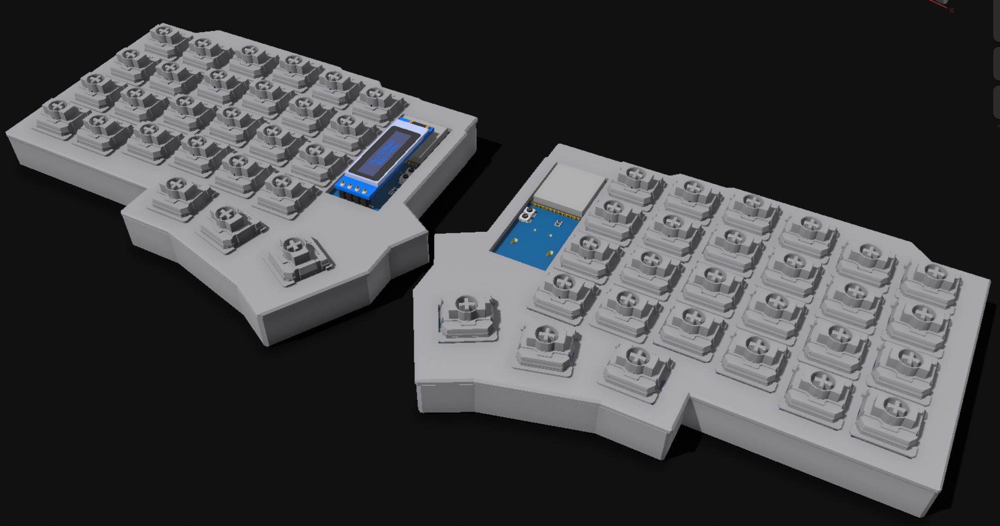

# Nibunkatsu One
## A Split Mechanical Keyboard Built with Hack Club Blueprint

にぶんかつ ✦ Nibunkatsu One is a compact, ergonomic split keyboard designed for everyday typing and programming. Built using the ESP32-S3 microcontroller with KMK firmware, it features per-key RGB underglow, an OLED display, and a rotary encoder.

This project was created as part of [Hack Club Blueprint](https://blueprint.hackclub.com), a program that empowers high school students to design, build, and ship real hardware products.

Estimation of time spent on this project: ~70 hours over 1 week of active work and learning.

## Features

- **Split Design**: 5x7 layout per half for comfortable typing
- **RGB**: 28 individually addressable LEDs per half under each key
- **OLED Display**: Shows layer status and keyboard info
- **Rotary Encoder**: Volume control
- **KMK Firmware**: Fully programmable with Python
- **3.5mm Audio Connection**: Split communication, with proper ESD protection.
- **Hotswap Sockets**: Easy switch replacement

## Keymap

The keyboard will use a 3-layer layout:

- **Layer 0 (Base)**: QWERTY layout with modifiers
- **Layer 1 (Numbers)**: Number row and symbols
- **Layer 2 (Navigation)**: Arrow keys and media controls

## Firmware

The firmware is written in Python using the KMK framework. It will support:

- Split communication via UART
- RGB lighting effects
- OLED display integration
- Rotary encoder support
- Multiple keymap layers

## Hardware

- **Microcontroller**: ESP32-S3 N8R4
- **Switches**: Cherry MX compatible hotswap sockets, personally I'll be using the Gateron Banana low profile switches!
- **Connection**: 3.5mm audio cable for split communication :P
- **Display**: 0.96" OLED screen
- **LEDs**: WS2812C-2020 RGB LEDs

## 3D Case Model
The case is designed using Shapr3D. The design files are included in the repository. Available in .3mf format.

There are 4 total models to be printed: Left case, Right case, Left plate and Right plate.

## Files

- `firmware/` - KMK firmware source code
- `PCB/` - EasyEDA PCB project files
- `CAD/` - 3D models for the keyboard case
- `assets/` - Most build photos and documentation

## Bill of Materials
A detailed bill of materials (BOM) can be soon found in the `bom.csv` file, listing all components required to build the keyboard, along with prices and the pages I used to fetch them.

## License
Idk what I'm doing here yet, but for now:

- **Hardware (PCB & CAD)**: CERN Open Hardware Licence v2.0
- **Firmware**: MIT License
- **Assets**: Creative Commons Attribution-ShareAlike 4.0 International

## Acknowledgments

Designed with 💙 by 𝕲𝕭. Special thanks to the Hack Club community for support.
